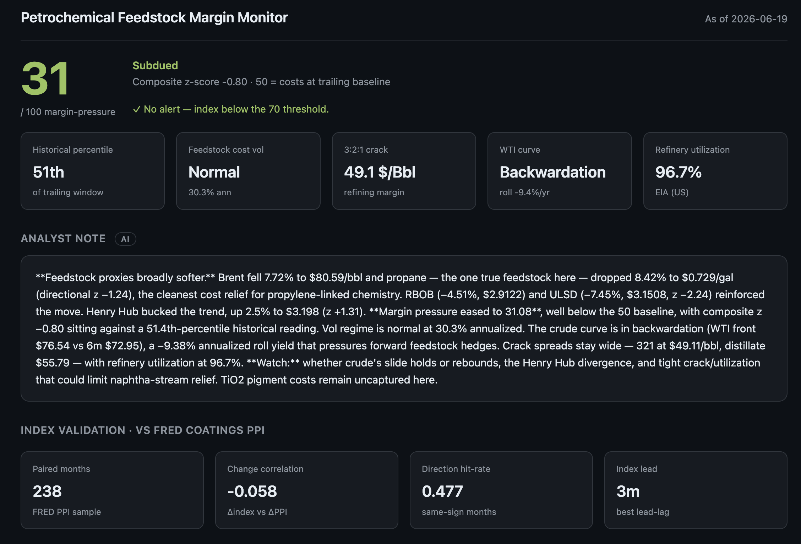
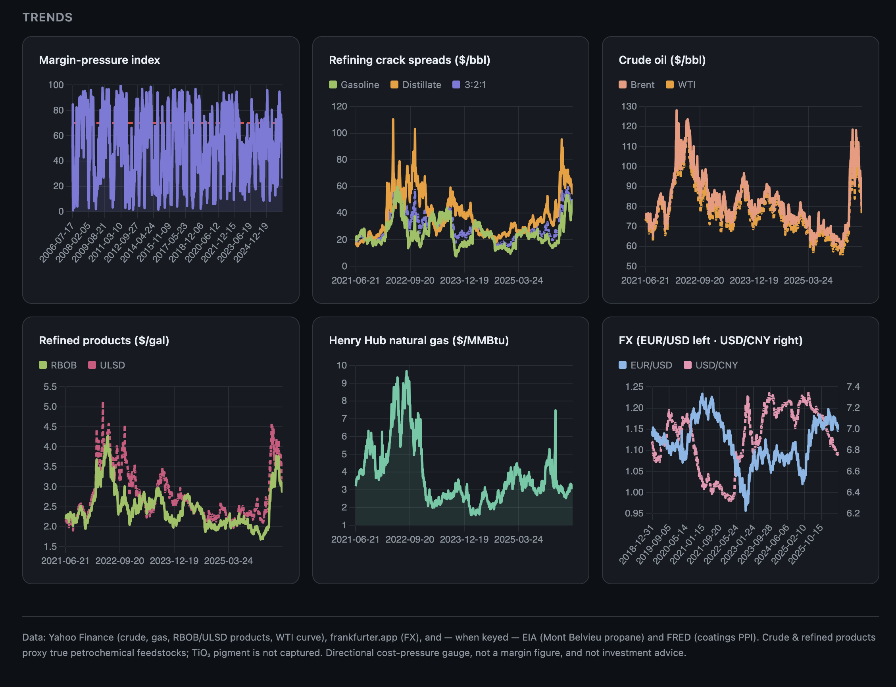

# Petrochemical Feedstock Margin Monitor

[](https://github.com/Saauc/feedstock-margin-monitor/actions/workflows/ci.yml)
[](LICENSE)


An autonomous, scheduled analytics pipeline that tracks the petrochemical input
costs driving coatings/paint manufacturing margins, frames them the way a
commodity desk would (margins as **crack spreads**, not price levels), contextualizes
them statistically (historical percentile, volatility regime, forward-curve
shape), interprets them with an LLM, and alerts when margin pressure crosses a
threshold.

**Why I built this.** I'm teaching myself how energy and commodity markets actually
work, and I learn fastest by building real systems rather than just reading about
them. This is my hands-on way into petrochemical margin analysis: I wanted to
understand why a coatings manufacturer's input costs move, frame it the way a
trading desk would (margins are *spreads*, not price levels), and at the same time
practice the full engineering arc — data ingestion, a typed and tested codebase,
statistical analysis, an LLM layer, and hands-off daily automation. It's a
**learning project**, built out of genuine interest in commodities and software —
not a production trading tool or investment advice. The analytics are deliberately
honest about their limits (see [Limitations](#limitations-read-this)); getting
comfortable saying clearly what a model *can't* do was part of the point.

## Dashboard





---

## What it does

Each day (via GitHub Actions) it:

1. **Ingests** crude (Brent, WTI), Henry Hub gas, refined products (RBOB gasoline,
   ULSD), and the WTI forward curve from Yahoo Finance; EUR/USD and USD/CNY from
   frankfurter.app; and — when keyed — Mont Belvieu propane + refinery utilization
   from **EIA** and the Paint & Coating Manufacturing **PPI** from **FRED**. All
   idempotent.
2. **Derives** refining **crack spreads** (gasoline, distillate, 3:2:1) and the
   **roll yield / curve state** (contango vs backwardation).
3. **Computes** a 0–100 *margin-pressure index* from z-scores of a documented
   coatings bill-of-materials basket, then **contextualizes** it: historical
   percentile, EWMA volatility, and vol regime.
4. **Narrates** the day with Claude (`claude-opus-4-8`) citing the spreads,
   percentile, and curve — with a templated fallback when the API is unavailable.
5. **Alerts** when the index crosses a threshold — a flag in the briefing, plus an
   optional (deduped) email.
6. **Persists** the updated database back to the repo so history accumulates.

A text **briefing** and a dark-theme Flask **dashboard** read the accumulated
history. A separate **backtest** validates the index against the FRED coatings PPI.

---

## Quick start

```bash
python3 -m venv .venv && source .venv/bin/activate
pip install -e ".[dev]"          # installs the package + ruff/mypy/pytest
cp .env.example .env             # optional keys: ANTHROPIC, EIA, FRED, SMTP

python -m feedstock.backfill     # one-time: load EIA/FRED history (after adding keys)
python -m feedstock.run_daily    # pipeline: ingest → analyze → narrate → alert → backtest
python -m feedstock.briefing     # plain-text daily briefing
python -m feedstock.app          # dashboard at http://127.0.0.1:5000
# or the installed entry points: feedstock-backfill / feedstock-run / feedstock-dashboard

pytest -q                        # 36 offline unit tests
ruff check src tests             # lint
mypy src                         # type-check
```

The index needs history to be meaningful — run the pipeline on several different
days (or let the cron do it) before reading too much into it. See Limitations.

---

## Methodology (how the index works)

- **Margins are spreads, not levels.** A producer's margin is the value of refined
  products *minus* the crude that made them. The tool computes real crack spreads
  from product-vs-crude futures (`spreads.py`), correctly converting $/gal products
  to a $/bbl basis (42 gal/bbl).
- **The cost model is the coatings value chain.** `spreads.COATINGS_BOM` documents
  the actual bill of materials — TiO₂ pigment, propylene-derived resins, solvents,
  process energy, freight — and maps each to its best free/official proxy. The
  petroleum/energy-linked portion forms the index basket (weights in `config.json`).
- **Statistical context** (`quant.py`): z-scores → logistic 0–100 index; historical
  percentile of the latest reading; EWMA (RiskMetrics λ=0.94) volatility; a vol
  regime classifier; and the futures-curve roll yield / state.
- **Validation** (`backtest.py`): correlation, directional hit-rate, OLS beta, and a
  lead-lag scan of the index against the FRED coatings PPI (needs a FRED key).

---

## Architecture

```
src/feedstock/        installable package
tests/                offline unit tests (pytest)
config.json           model config (weights, directions, thresholds, series IDs)
feedstock.db          accumulating SQLite history (committed back by CI)
.github/workflows/     daily.yml (data cron) · ci.yml (lint/type/test)
```

| Module | Responsibility |
|--------|----------------|
| `http.py` | Shared HTTP session with retry/backoff (all data calls) |
| `paths.py` | Resolve project-root config/DB paths |
| `ingest.py` | Pull free sources; one isolated function per source |
| `official_data.py` | EIA + FRED clients (key-gated, graceful) |
| `spreads.py` | Crack spreads + coatings BOM value-chain model |
| `term_structure.py` | WTI forward curve → contango/backwardation |
| `store.py` | SQLite; idempotent writes; observations/narratives/alert tables |
| `transform.py` | Pure index math (z-scores, logistic, alignment) — unit-tested |
| `quant.py` | EWMA vol, percentile, vol regime, roll yield — unit-tested |
| `backtest.py` | Validate index vs FRED coatings PPI — unit-tested |
| `analysis.py` | Wire config + DB to the math; persist index + quant context |
| `narrative.py` | Claude call citing spreads/percentile/curve + templated fallback |
| `alerting.py` | Threshold eval, briefing flag, optional deduped email |
| `briefing.py` | Plain-text daily briefing |
| `app.py` | Interactive dark dashboard (date scrubber, live basket reweighting) |
| `run_daily.py` | Orchestrates the full pipeline (CI entry point) |

Data flow: `ingest` + `official_data` → SQLite (`store`) → `analysis` + `quant` +
`spreads` → `narrative` / `alerting` / `backtest` → `briefing` / `app`.
`run_daily` chains the steps; the GitHub Actions cron runs it daily and commits
the updated database back.

---

## Deploy the dashboard (Render)

The dashboard is a one-click deploy — no secrets needed (it's read-only over the
committed `feedstock.db` and recomputes everything client-side).

[](https://render.com/deploy?repo=https://github.com/Saauc/feedstock-margin-monitor)

Or manually: Render → **New → Blueprint** → connect this repo. It reads
[`render.yaml`](render.yaml) and serves `gunicorn feedstock.app:app`. The page is
fully interactive without a backend round-trip — scrub the date, reweight the
coatings basket, and the margin-pressure index recomputes live in the browser.

---

## Data automation (GitHub Actions)

- Push to GitHub; `daily.yml` runs at **06:00 UTC** (and on-demand via the Actions
  tab). `ci.yml` runs lint + type-check + tests on every push/PR.
- Add secrets under **Settings → Secrets and variables → Actions**: `ANTHROPIC_API_KEY`
  (AI narrative), `EIA_API_KEY` + `FRED_API_KEY` (official data + backtest), `SMTP_*`
  (alert email). Everything degrades gracefully if a secret is absent.
- The daily job commits the updated `feedstock.db` back to the repo (history) and
  uploads it as an artifact.

Repo: **https://github.com/Saauc/feedstock-margin-monitor**. It runs entirely on
free tiers — the free data sources above plus the free GitHub Actions runner — so
operating it costs nothing beyond a few cents a day of Anthropic API usage for the
narrative (and that's optional; it falls back to a templated summary without a key).

---

## Limitations (read this)

This is a **directional cost-pressure gauge**, not a margin P&L model. Be honest
about what it can and cannot tell you:

- **Proxies, not the real feedstocks.** Crude and refined products stand in for true
  petrochemical feedstocks. Propane (EIA) is the one genuine feedstock when keyed;
  otherwise resins are proxied via gasoline-range light ends. **TiO₂ pigment — the
  single largest coatings input (~20–25%) — has no free price and is not captured.**
  Documented explicitly in `spreads.COATINGS_BOM`.
- **Pressure vs. a trailing baseline, not absolute margins.** 50 = "costs are where
  they've recently been." There are **no product (paint) prices, volumes, contracts/
  hedging, or plant economics** — it can't tell you if a manufacturer is profitable.
- **Weights/directions are hand-set heuristics**, informed by the coatings BOM but
  not fitted to realized margins. Treat `config.json` as a documented opinion.
- **The backtest is honest, and the honest result is humbling.** Validated over
  ~240 months of FRED coatings PPI history, the free-data feedstock proxies show
  only *weak* correlation with the actual PPI (level corr ≈ 0.1–0.2, change corr
  ≈ 0, direction hit-rate ≈ 0.5). This isn't hidden — it's the point. It
  empirically confirms the limitation above: the coatings PPI is dominated by
  TiO₂, labor, packaging, and producer margin, which free feedstock data cannot
  see. The tool is a directional read on the *petroleum-linked slice* of input
  cost, not a predictor of the PPI. The validation exists precisely to keep that
  claim falsifiable rather than asserted.
- **Cold start.** With little history the index returns a flagged neutral 50 and
  raises no alerts; percentile/vol/regime stay "unknown". It needs on the order of
  the `trailing_window` (~60 obs) before z-scores stabilize, and far more before the
  percentile context is meaningful.
- **Free-data fragility.** Yahoo's chart endpoint is unofficial (can rate-limit or
  change shape — hence the retry layer); frankfurter serves ECB *reference* rates
  (daily, weekdays only). Cross-source date alignment is approximate.
- **The AI narrative is interpretation**, given only the computed numbers and told to
  stay factual — not a source of truth, not financial advice.
- **Simplified single-region view.** FX limited to EUR/USD, USD/CNY; no regional
  crude differentials, freight lanes, or local feedstock markets.
- **Not investment advice.** Nothing here should drive a trade or procurement decision
  on its own.
- **It's a learning project, full stop.** I built it to learn commodity-market
  reasoning and end-to-end data engineering — not to trade on. Every number here is
  a learning artifact, and the limitations above are features of being honest about
  that, not disclaimers bolted on at the end.

---

## License

MIT — see [`LICENSE`](LICENSE). Use it, fork it, learn from it.
